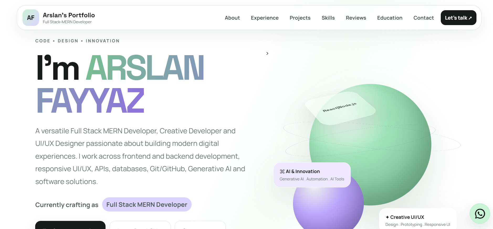
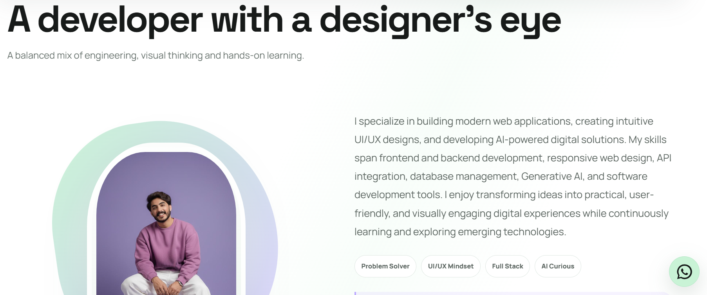
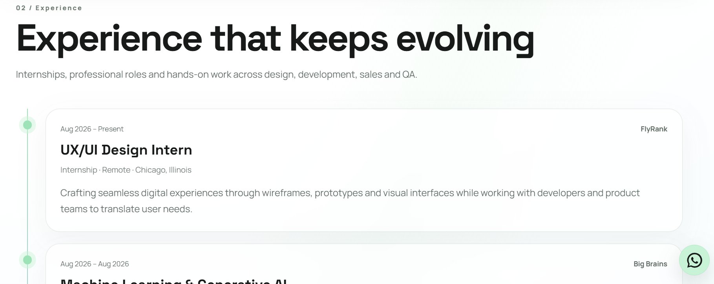
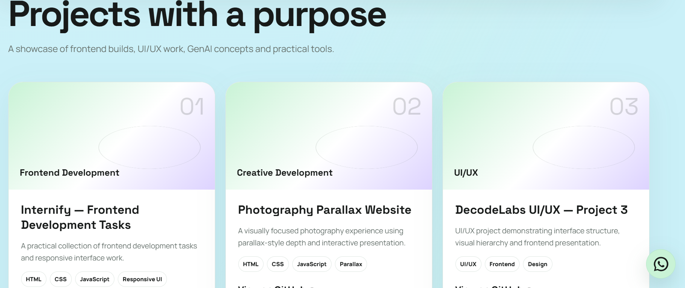
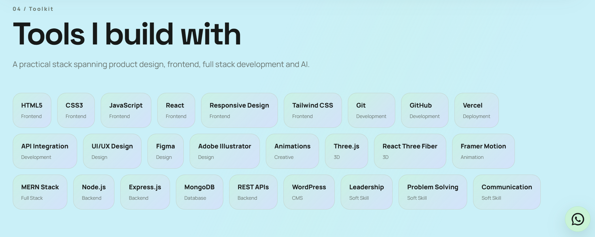
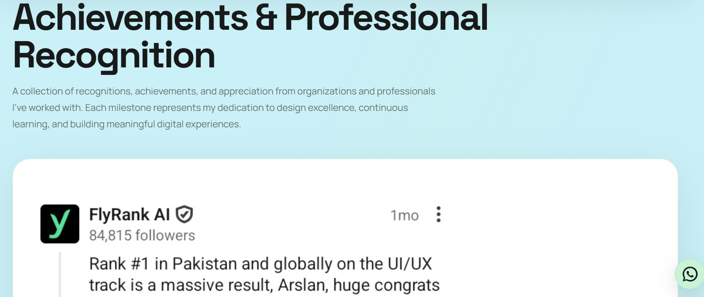
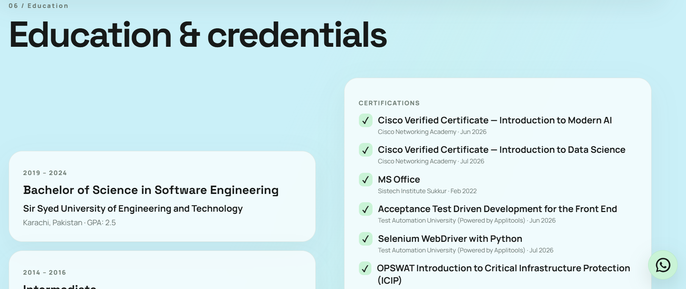
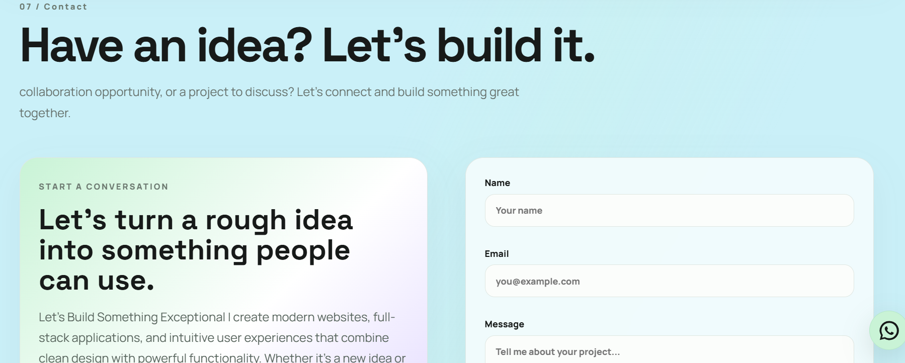
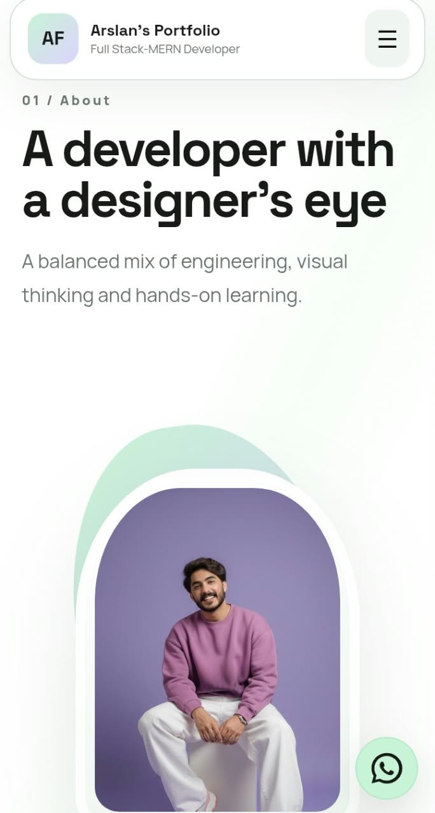

# Arslan Fayyaz — Personal Portfolio

### Full Stack MERN Developer · UI/UX Designer · Creative Developer

<p align="center">
  A modern, responsive portfolio showcasing my projects, technical skills, professional experience, achievements, and creative work.
</p>

<p align="center">
  <a href="https://3d-portfolio-rust-beta.vercel.app/">Live Portfolio</a> ·
  <a href="https://github.com/arslanfayyaz1997">GitHub</a> ·
  <a href="mailto:arslanfayyaz1997@gmail.com">Email Me</a>
</p>

---

## About the Project

This portfolio presents my professional identity, development work, UI/UX design interests, experience, and achievements in one place. It combines a clean visual layout with soft gradients, rounded interface elements, responsive sections, and interactive details.

The goal is to give recruiters, clients, collaborators, and developers an easy way to explore my work and contact me.

## Features

- **Hero section:** Introduction, professional focus, and calls to action.
- **About Me:** Background, development philosophy, and interests.
- **Experience & Internships:** Roles, organizations, dates, and descriptions.
- **Projects:** Project cards, summaries, technology tags, and repository/demo links.
- **Technical Skills:** Categorized skills with visual badges and hover interactions.
- **Achievements & Recognition:** Recognition screenshots presented in a carousel-style section.
- **Education & Certifications:** Education and learning milestones.
- **Contact section:** Contact information, location link, and project inquiry form.
- **Social links:** GitHub, LinkedIn, Instagram, and email.
- **Floating WhatsApp shortcut:** Direct contact link.
- **Responsive layout:** Adaptations for desktop, tablet, and mobile screens.

## Design & Animation

The interface uses a modern, minimal visual style with soft gradients, clear typography, rounded cards, subtle borders, shadows, and spacing designed to keep content readable.

Interactive details may include:

- Hover transitions on buttons, cards, navigation links, and skill badges.
- CSS transforms and shadows that add depth to selected interface elements.
- Animated or gradient-highlighted visual elements.
- Smooth section navigation.
- Recognition carousel controls and slide transitions.
- Form focus states and responsive layout adjustments.

The exact effects depend on the current implementation. The project primarily uses frontend styling and component interactions rather than requiring every element to be rendered in 3D.

## Screenshots


### Home / Hero


### About Me


### Experience & Internships


### Projects


### Skills


### Achievements & Recognition


### Education


### Contact


### Mobile View



## Technologies

- **React** — Component-based UI.
- **JavaScript (ES6+)** — Application logic and interactions.
- **HTML5** — Page structure.
- **CSS3** — Styling, responsive layouts, transitions, and animations.
- **Vite** — Development server and build tooling.
- **Git & GitHub** — Version control and source hosting.
- **Vercel** — Deployment and hosting.

Only list additional libraries or services if they are actually installed and used in the project.

## Project Structure

```text
portfolio/
├── docs/
│   └── screenshots/
│       ├── home-hero.png
│       ├── about-section.png
│       ├── experience-section.png
│       ├── projects-section.png
│       ├── skills-section.png
│       ├── recognition-section.png
│       ├── education-section.png
│       ├── contact-section.png
│       └── mobile-view.png
├── public/
│   └── reviews/              # Recognition screenshots used by the website, if applicable
├── src/
│   ├── assets/
│   ├── components/
│   ├── hooks/
│   ├── lib/
│   ├── pages/
│   ├── app.js
│   ├── main.jsx
│   └── style.css
├── package.json
└── README.md
```

> This is a guide to the expected organization, not a replacement for your actual source files. Keep the existing project structure unchanged.

## Run Locally

Make sure Node.js and npm are installed.

```bash
npm install
npm run dev
```

Vite will show the local development address in your terminal, often `http://localhost:5173/`.

Create a production build with:

```bash
npm run build
```

These commands assume the corresponding scripts exist in `package.json`.

## Deployment

The live portfolio is hosted on Vercel:

**https://3d-portfolio-rust-beta.vercel.app/**

For updates, edit the existing project files, commit the changes to the connected GitHub repository, and verify the new deployment on the live website.

## Updating Portfolio Content

- **Text and sections:** Edit the relevant existing component or data file under `src/`.
- **Colors and animations:** Review `src/style.css`.
- **Projects and experience:** Update the existing project or experience data and keep links accurate.
- **Recognition carousel:** Add the website's review images to the appropriate existing asset folder and update the data used by the carousel.
- **Social links:** Update the existing footer or social-links data.
- **Contact details:** Verify the email, WhatsApp number, map URL, and form configuration.

## Accessibility & Privacy

- Keep text readable and links descriptive.
- Provide meaningful alternative text for screenshots and images.
- Test navigation and forms with a keyboard.
- Avoid committing private API keys, passwords, or other secrets.
- Publish only contact information intended to be public.

## Future Improvements

Possible future improvements include more detailed project case studies, additional demos, accessibility testing, performance optimization, and enhanced mobile interactions. These are ideas for future work, not claims that the features are already implemented.

## About Me

**Arslan Fayyaz**  
Full Stack MERN Developer · UI/UX Designer · Creative Developer

I enjoy building responsive web experiences, designing intuitive interfaces, exploring emerging technologies, and turning ideas into practical digital solutions.

### Connect

- **Portfolio:** https://3d-portfolio-rust-beta.vercel.app/
- **GitHub:** https://github.com/arslanfayyaz1997/
- **LinkedIn:** https://www.linkedin.com/in/arslan-fayyaz-3a4781214
- **Instagram:** https://www.instagram.com/arsfamixm/
- **Email:** arslanfayyaz1997@gmail.com

---

<p align="center">
  Built by <strong>Arslan Fayyaz</strong> · React + Vite
</p>
